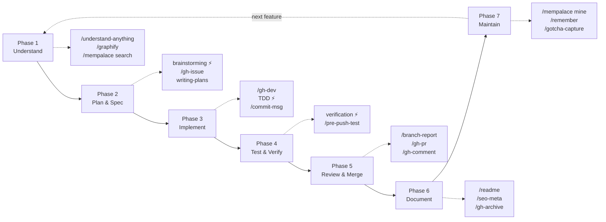
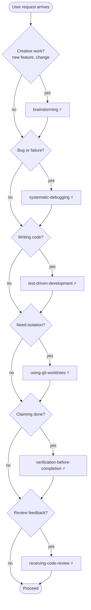
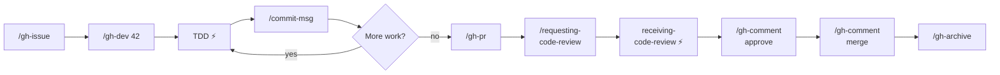
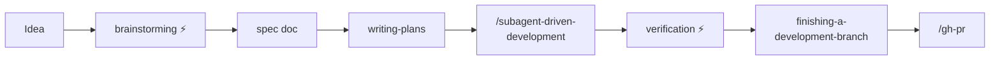

# Development Workflow with chuan-skills

An operating manual for the skills installed via this marketplace. Organized by development phase so you can look up **"what skill do I need right now?"** instead of hunting by name.

Skills tagged **⚡ auto** are fired automatically by the superpowers `using-superpowers` meta-skill — you rarely invoke them by hand. Everything else is called via `/slash-command`.

---

## Quick Reference

| When you want to...                           | Use                                                      |
|-----------------------------------------------|----------------------------------------------------------|
| Understand a new codebase                     | `/understand-anything`, `/graphify`                      |
| Recall prior session knowledge                | `/mempalace search`                                      |
| Brainstorm a feature before building          | brainstorming ⚡                                          |
| Write a formal spec                           | `/openspec` (or brainstorming → writing-plans)           |
| Plan implementation steps                     | writing-plans, `/planning-with-files`                    |
| Execute a written plan                        | executing-plans, subagent-driven-development             |
| Isolate feature work                          | using-git-worktrees ⚡                                    |
| Build frontend UI                             | `/frontend-design` (impeccable)                          |
| Implement with TDD                            | test-driven-development ⚡                                |
| Debug a failure                               | systematic-debugging ⚡                                   |
| Run parallel independent tasks                | dispatching-parallel-agents                              |
| Suggest commit messages                       | `/commit-msg`                                            |
| File a GitHub issue                           | `/gh-issue`                                              |
| Start work on an issue                        | `/gh-dev <n>`                                            |
| Open or update a PR                           | `/gh-pr`                                                 |
| Comment, approve, or merge a PR               | `/gh-comment`                                            |
| Compare branch changes for summary            | `/branch-report`                                         |
| Verify work before claiming done              | verification-before-completion ⚡                         |
| Block push on test failure                    | `/pre-push-test` (one-time setup)                        |
| Finish a dev branch                           | finishing-a-development-branch                           |
| Write or improve README                       | `/readme`                                                |
| Add SEO frontmatter to an article             | `/seo-meta`                                              |
| End-of-session docs snapshot                  | `/gh-archive`                                            |
| Save session state                            | `/remember`                                              |
| Mine project into long-term memory            | `/mempalace mine`                                        |
| Create a new skill                            | `/skill-creator`, writing-skills                         |
| Benchmark a skill                             | `/skill-benchmark <name>`                                |
| Capture lessons into a skill                  | `/gotcha-capture <name>`                                 |
| Audit CLAUDE.md                               | `/claude-md-improver`                                    |

---

## Workflow Diagrams

### Development Lifecycle at a Glance



### Auto-Triggering Skill Flow



### Full Feature Chain (Issue → Merge)



### Spec-Driven Chain (Idea → Done)



---

## Development Lifecycle

### Phase 1 — Understand the Project

Before writing any code, get a map of the territory.

| Skill                | Command                | When                                              | Auto? |
|----------------------|------------------------|---------------------------------------------------|-------|
| understand-anything  | `/understand-anything` | New codebase; want an interactive knowledge graph |       |
| graphify             | `/graphify`            | Turn code/docs/PDFs into a visual graph           |       |
| mempalace            | `/mempalace search`    | Recall context from prior sessions                |       |
| claude-md-improver   | `/claude-md-improver`  | Audit or refresh project CLAUDE.md                |       |

**Typical flow**

```
/mempalace search "project X"   # what do I already know?
/understand-anything            # build knowledge graph
/graphify                       # visualize architecture
/claude-md-improver             # ensure project memory is current
```

---

### Phase 2 — Plan & Specify

Turn intent into a design, then into a step-by-step plan.

| Skill                | Command                  | When                                         | Auto? |
|----------------------|--------------------------|----------------------------------------------|-------|
| brainstorming        | (auto)                   | Before **any** creative work                 | ⚡     |
| openspec             | `/openspec`              | Formal spec-driven framework                 |       |
| writing-plans        | (chained from brainstorm)| Turn approved spec into implementation plan  | chain |
| planning-with-files  | `/planning-with-files`   | Create `task_plan.md` / `progress.md` / `findings.md` for >5-step tasks |       |
| gh-issue             | `/gh-issue`              | File structured issue (bug, feat, refactor, doc, perf, security) |       |

brainstorming is a **hard gate**: it will not let you proceed to implementation until a design is presented and approved. The chain flows brainstorm → spec doc → writing-plans → execution.

**planning-with-files vs writing-plans**: the former is a lightweight tracker (progress/findings files); the latter produces a detailed bite-sized plan with TDD steps.

**Typical flow**

```
"I want to add dark mode"       # brainstorming auto-triggers
(approve design)                # brainstorming writes spec, chains writing-plans
/gh-issue                       # file as trackable work
```

---

### Phase 3 — Implement

Code the plan. Branch per issue, TDD by default, commit with conventions.

| Skill                         | Command                          | When                                      | Auto? |
|-------------------------------|----------------------------------|-------------------------------------------|-------|
| gh-dev                        | `/gh-dev <issue>`                | Branch from an issue, develop             |       |
| using-git-worktrees           | (auto)                           | Isolate feature work from main workspace  | ⚡     |
| test-driven-development       | (auto)                           | Before writing any implementation code    | ⚡     |
| executing-plans               | `/executing-plans`               | Execute a plan in the current session     |       |
| subagent-driven-development   | `/subagent-driven-development`   | Execute plan with a fresh agent per task (recommended) |       |
| dispatching-parallel-agents   | `/dispatching-parallel-agents`   | 2+ truly independent tasks                |       |
| frontend-design               | `/frontend-design`               | Building web UI                           |       |
| systematic-debugging          | (auto)                           | Any bug, test failure, or surprise        | ⚡     |
| commit-msg                    | `/commit-msg`                    | Get 3 commit message options from staged diff |   |

gh-dev never pushes to remote; branches are always `issues/<N>`. It also supports multi-issue parallel work ("implement 17, 18, 19 in parallel") using worktree agents.

**Chains**

```
# Issue-driven
/gh-dev 42
  └─ TDD ⚡ for each feature
  └─ /commit-msg at each checkpoint

# Plan-driven
(from Phase 2)
/subagent-driven-development
  └─ using-git-worktrees ⚡
  └─ TDD ⚡

# Parallel sprint
/gh-dev "17, 18, 19 parallel"
  └─ dispatching-parallel-agents
```

---

### Phase 4 — Test & Verify

Quality gates before anyone claims success.

| Skill                            | Command          | When                                          | Auto? |
|----------------------------------|------------------|-----------------------------------------------|-------|
| test-driven-development          | (auto)           | Tests before implementation (see Phase 3)     | ⚡     |
| verification-before-completion   | (auto)           | Before any claim of "done", "fixed", "passing" | ⚡    |
| systematic-debugging             | (auto)           | On any failure                                | ⚡     |
| pre-push-test                    | `/pre-push-test` | One-time: install test-gated push hook        |       |

`verification-before-completion` is the no-bullshit gate: run the command, observe the output, then claim success. It fires before commits, PRs, and next-task transitions.

**Setup (once per repo)**

```
/pre-push-test   # installs .git/hooks/pre-push, Claude auto-fixes up to 3 retries
```

---

### Phase 5 — Review & Merge

Open the PR, get it reviewed, respond, merge.

| Skill                           | Command                       | When                                           | Auto? |
|---------------------------------|-------------------------------|------------------------------------------------|-------|
| branch-report                   | `/branch-report`              | Pre-merge summary (plain-English + senior-dev) |       |
| gh-pr                           | `/gh-pr`                      | Push branch + create/update PR                 |       |
| requesting-code-review          | `/requesting-code-review`     | Dispatch code-reviewer subagent                |       |
| /review                         | `/review`                     | Claude Code's built-in PR review               |       |
| receiving-code-review           | (auto)                        | Handling review feedback with rigor            | ⚡     |
| gh-comment                      | `/gh-comment`                 | Comment / approve / request-changes / merge    |       |
| finishing-a-development-branch  | (chained)                     | After implementation is done                   | chain |

`gh-pr` optionally invokes `readme` and `planning-with-files` before opening the PR; body includes `Closes #N` for linked auto-close. `gh-comment merge` prefers rebase and offers post-merge cleanup + issue wrap-up.

**Chain**

```
/branch-report                # summary to sanity-check
/gh-pr                        # push + open PR (auto-refreshes README if enabled)
/requesting-code-review       # subagent review
(address feedback)            # receiving-code-review ⚡ guides response
/gh-comment approve
/gh-comment merge             # rebase, close issue, delete branch
```

---

### Phase 6 — Document & Publish

Keep docs current; prep writing for publishing.

| Skill        | Command       | When                                        | Auto? |
|--------------|---------------|---------------------------------------------|-------|
| readme       | `/readme`     | Create or improve README (+screenshots)     |       |
| seo-meta     | `/seo-meta`   | Add SEO YAML frontmatter to markdown        |       |
| gh-archive   | `/gh-archive` | End-of-session docs snapshot                |       |
| graphify     | `/graphify`   | Architecture visualization for docs         |       |

`gh-archive` orchestrates `readme` + `planning-with-files`, producing `docs/task_plan.md`, `docs/findings.md`, `docs/progress.md`.

**Typical flow**

```
/readme          # refresh after features landed
/seo-meta post.md  # prep blog post
/gh-archive       # snapshot state before stepping away
```

---

### Phase 7 — Maintain & Remember

Persist knowledge, improve skills, keep CLAUDE.md honest.

| Skill                  | Command                   | When                                           | Auto? |
|------------------------|---------------------------|------------------------------------------------|-------|
| mempalace              | `/mempalace`              | Mine project/conversations into memory palace  |       |
| remember               | `/remember`               | Save session state for clean continuation      |       |
| gotcha-capture         | `/gotcha-capture <skill>` | After a skill fails — capture lessons         |       |
| skill-benchmark        | `/skill-benchmark <skill>`| Score a skill across 6 dimensions              |       |
| skill-creator          | `/skill-creator`          | New skills or iteration                        |       |
| writing-skills         | (chained)                 | TDD approach to skill building                 | chain |
| claude-md-improver     | `/claude-md-improver`     | Audit/improve CLAUDE.md                        |       |

**Typical flow**

```
/gotcha-capture gh-pr          # something went sideways — record it
/skill-benchmark readme        # is this skill still worth keeping?
/mempalace mine                # index this project
/remember                      # checkpoint session
```

---

## Skill Chains

Six real workflows. Each shows arrows between skills; `⚡` steps fire automatically.

**1. Full Feature (Issue → Merge)**

```
/gh-issue → /gh-dev → TDD ⚡ → /commit-msg → /gh-pr
  → /gh-comment approve → /gh-comment merge → /gh-archive
```

**2. Spec-Driven (Idea → Done)**

```
brainstorming ⚡ → writing-plans → /subagent-driven-development
  → verification-before-completion ⚡ → finishing-a-development-branch → /gh-pr
```

**3. Bug Fix**

```
systematic-debugging ⚡ → TDD ⚡ (write failing test first)
  → /commit-msg → /gh-pr
```

**4. Parallel Multi-Issue Sprint**

```
/gh-issue × N → /gh-dev "N1, N2, N3 parallel"
  → dispatching-parallel-agents → TDD ⚡ per branch
  → /gh-pr × N → /gh-comment (review/merge)
```

**5. Documentation Refresh**

```
/readme → /seo-meta (for articles) → /gh-archive → /mempalace mine
```

**6. Skill Development**

```
brainstorming ⚡ → /skill-creator → /skill-benchmark
  → (real usage) → /gotcha-capture
```

---

## Auto-Triggering Skills

Superpowers' `using-superpowers` meta-skill enforces: **if there's even a 1% chance a skill applies, invoke it**. These fire without explicit slash commands.

| Skill                          | Fires when...                                            |
|--------------------------------|----------------------------------------------------------|
| brainstorming                  | Before any creative work (features, components, changes) |
| test-driven-development        | Before writing any implementation code                   |
| systematic-debugging           | Any bug, test failure, unexpected behavior               |
| verification-before-completion | Before claiming complete / fixed / passing               |
| receiving-code-review          | When review feedback arrives                             |
| using-git-worktrees            | Starting isolated feature work                           |

**Priority order**: process skills (brainstorming, debugging) fire **before** implementation skills (frontend-design, etc.).

---

## Cheat Sheet

```
# Starting work
/gh-issue                         # file a structured issue
/gh-dev 42                        # branch issues/42 and start
/gh-dev "17, 18, 19 parallel"     # multi-issue via worktrees

# During development
/commit-msg                       # 3 commit message options
/branch-report                    # branch vs default summary

# Finishing work
/gh-pr                            # push + open PR
/gh-comment approve               # approve a PR
/gh-comment merge                 # merge (rebase preferred)
/gh-archive                       # end-of-session snapshot

# Documentation
/readme                           # README create/improve
/seo-meta article.md              # add SEO frontmatter

# Understanding code
/understand-anything              # interactive knowledge graph
/graphify                         # visualize codebase

# Memory & learning
/mempalace search "query"         # recall across sessions
/mempalace mine                   # index current project
/remember                         # checkpoint session
/gotcha-capture <skill>           # capture failure knowledge

# Skill maintenance
/skill-creator                    # new skill
/skill-benchmark <name>           # score a skill
/claude-md-improver               # audit CLAUDE.md

# One-time setup
/pre-push-test                    # test-gated push hook
```

---

## Skill Sources

| Skill(s)                                                             | Source   | Location                              |
|----------------------------------------------------------------------|----------|---------------------------------------|
| commit-msg, readme, branch-report, seo-meta, pre-push-test           | Local    | `plugins/<name>/`                     |
| gh-issue, gh-dev, gh-pr, gh-comment, gh-archive                      | Local    | `plugins/gh/`                         |
| gotcha-capture, skill-benchmark                                      | Local    | `plugins/skill-optimize/`             |
| brainstorming, writing-plans, executing-plans, TDD, debugging, …    | External | `obra/superpowers`                    |
| skill-creator, writing-skills                                        | External | `anthropics/skills`                   |
| understand-anything                                                  | External | `Lum1104/Understand-Anything`         |
| planning-with-files                                                  | External | `OthmanAdi/planning-with-files`       |
| frontend-design                                                      | External | `pbakaus/impeccable`                  |
| openspec                                                             | External | `Fission-AI/OpenSpec`                 |
| graphify                                                             | External | `safishamsi/graphify`                 |
| mempalace                                                            | External | `MemPalace/mempalace`                 |

> Local bilingual skills (`gh-*`, `branch-report`, `readme`, `seo-meta`) auto-detect Traditional Chinese from existing documentation.
